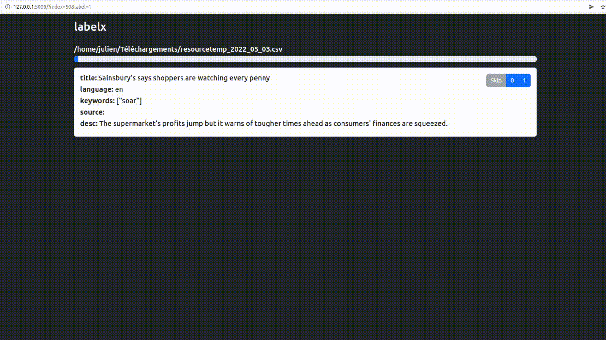

# labelx
A Flask application to manually label an existing dataset.

### Example scenario
You want to create a training dataset for your next model. You have your `assets/cars.csv` with already several fields:
```
Car;MPG;Cylinders;Displacement;Horsepower;Weight;Acceleration;Model;Origin
```
On top of these, you want to add a custom field with a special value that actually, just a human can set.
For example: `Good_Looking`, with two possible values `Yes` and `Ǹo`.  
The objective is to go through a maximum of dataset rows and set this value.
Iterating manually over the CSV file is not the more efficient way to do it.  
With this project, you define the label settings and the labelling interface appearance and quickier your manual labelling.

### Demo
<p align="center">
    
</p>

### Configuration
Update the `config.json` file to configure project.
```
{
    "data": {
        "input": "assets/cars.csv",
        "output": "assets/labelled_cars.csv",
        "delimiter": ";"
    },
    "interface": {
        "fields": ["Car", "Model", "Origin"],
        "theme": "light"
    },
    "label": {
        "name": "Good_Looking",
        "values": ["Yes", "No"]
    }
}
```

### Setup instructions
1. Installing virtual environment:
```
python3 -m pip install --user virtualenv
python3 -m venv env
source env/bin/activate
```
2. Installing dependencies:
```
make
```
3. Starting project:
```
make run
```
Labelling interface now available at `http://127.0.0.1:5000`.

### Roadmap
- Fix setuptools configuration;
- Handle errors use cases (no config, no input, etc.);
- Improve CI;
- Setup release flow;
- Implement skip button.